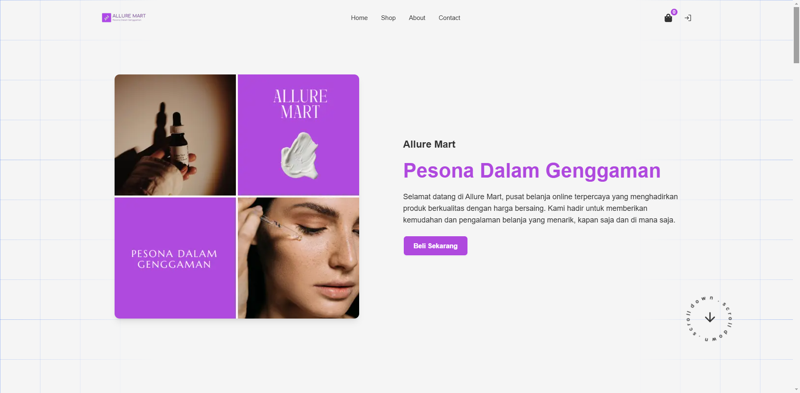

# Allure Mart 🚀

Welcome to my professional e-commerce website! This site showcases my work as a Fullstack Developer and my journey in web development.

## 🌐 Live Demo

Check out my e-commerce at [allure-mart.vercel.app](https://allure-mart.vercel.app)

## ⚡ Tech Stack

This e-commerce is built with:

- Next.js 15
- React 19
- Framer Motion
- Firebase
- GSAP
- SWR
- React Query
- React Hook Form
- React Select
- Midtrans
- Tailwind CSS
- React Hot Toast
- React Icons
- Lucide React
- React Quill
- React Share
- Date-fns

## 🎯 Features

- 🎨 Modern and Clean Design
- 📱 Fully Responsive
- ⚡ Fast Performance
- 🎬 Smooth Animations
- 📊 Interactive Components
- 🎮 3D Elements
- 📝 Project Section
- 📬 Contact Form with Validation
- 🎨 Custom CSS Animations
- 🔄 Loading States/Transitions
- 📱 PWA Support
- 🔒 Firebase Authentication

## 🛠️ Projects Showcase

Browse through my featured projects and see my skills in action. Each project includes:

- Detailed descriptions
- Technologies used
- Live demos
- Source code links

## 📫 Get in Touch

- Email: rr8027896@gmail.com
- LinkedIn: [Rizki Ramadhan](https://www.linkedin.com/in/rizki-ramadhan12)
- Instagram: [rzkir.20](https://www.instagram.com/rzkir.20)
- GitHub: [Rineta2](https://github.com/Rineta2)

## 🚀 Local Development

To run this project locally:

1. Clone the repository
2. Install dependencies
3. Run the development server

# Allure Mart

Jika ingin menggunakan full access, silahkan hubungi saya di email rr8027896@gmail.com atau whatsapp [wa.me/6281398632939](https://wa.me/6281398632939)
